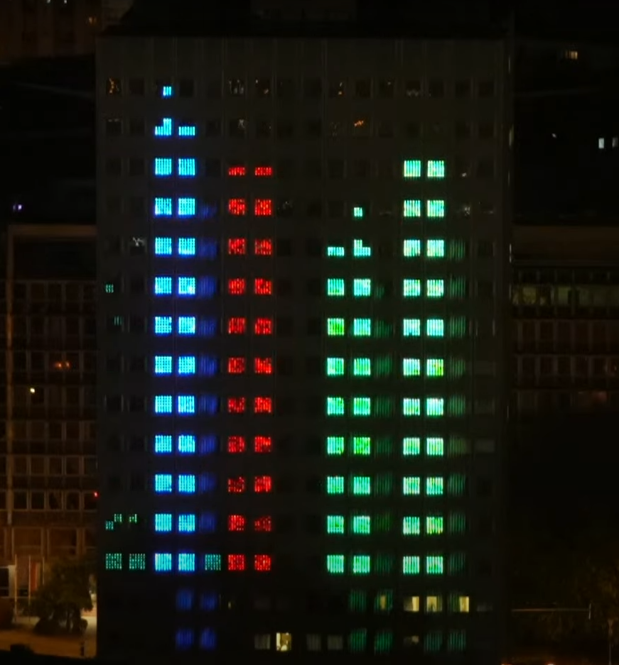

# Mátrix clicker



I'm sorry, I optimized for delivery speed, not readability. This project was very experimental.

## Important todos for next year

- Implement clock synchronization, like [Cristian's algorithm](https://en.wikipedia.org/wiki/Cristian%27s_algorithm).
- Review the colors used. [reference](https://www.youtube.com/live/feULovk98Yo?si=koM9D1hKouaIOrIm&t=5032)

## Needed software

- Node.js 22
- Go 1.25.0
- Docker
- kubectl and Helm

## How to set up the client

After cloning create a copy of `.env.example`, name it `.env`, then run

```bash
cd client
npm install
```

## How to set up the server

After cloning run

```bash
cd server
go mod download
go mod tidy
go mod vendor
```

## How to deploy

After cloning, **set up the server and client** and run

```bash
docker compose build
docker compose push

helm install -n <namespace> matrix-clicker ./helm
```

## The shaders for the lobby and gameplay animation were based on these. Thank you!

- https://www.shadertoy.com/view/MtlyR8
- https://www.shadertoy.com/view/lsyfWD
