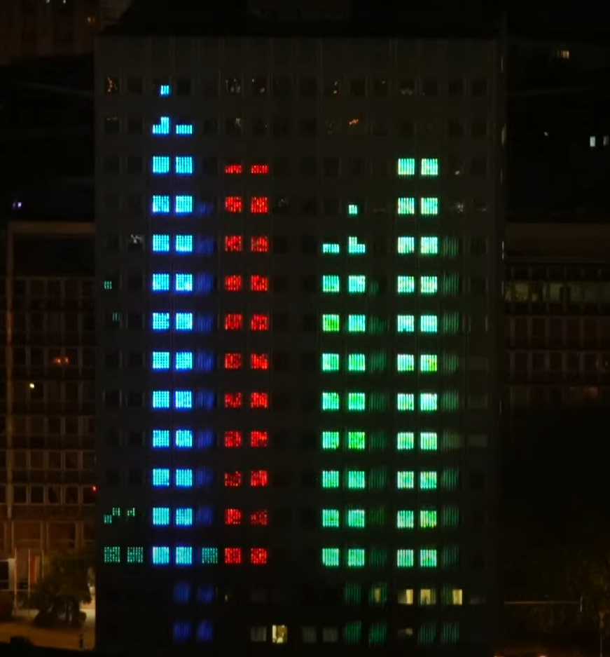

# Mátrix clicker



I'm sorry, I optimized for delivery speed, not readability. This project was very experimental.

## Important todos for next year

- Implement clock synchronization, like [Cristian's algorithm](https://en.wikipedia.org/wiki/Cristian%27s_algorithm).
- Review the colors used. [reference](https://www.youtube.com/live/feULovk98Yo?si=koM9D1hKouaIOrIm&t=5032)

## Needed software

- Node.js 22
- Go 1.25.0
- Docker
- kubectl and Helm

## How to set up the client

After cloning create a copy of `.env.example`, name it `.env`, then run

```bash
cd client
npm install
```

`.env` is only for `npm run dev` and `npm run preview`. The container reads `VITE_API_BASE_URL` and
`VITE_WS_BASE_URL` from its own environment instead, see below.

## How to set up the server

After cloning run

```bash
cd server
go mod download
go mod tidy
go mod vendor
```

## How to deploy

After cloning, **set up the server and client** and run

```bash
docker compose build
docker compose push

helm install -n <namespace> matrix-clicker ./helm
```

The client image is the same in every environment. `client/index.html` ships `__VITE_API_BASE_URL__`
and `__VITE_WS_BASE_URL__` placeholders, and `client/entrypoint.sh` substitutes the values of the
`VITE_API_BASE_URL` and `VITE_WS_BASE_URL` environment variables into the served HTML on startup.
So retargeting a deployment is a config change, not a rebuild:

```bash
helm upgrade -n <namespace> matrix-clicker ./helm \
  --set frontend.apiBaseUrl=https://api.example.com \
  --set frontend.wsBaseUrl=wss://api.example.com
```

`docker-compose.yml` sets the same two variables for local runs.

## The shaders for the lobby and gameplay animation were based on this. Thank you!

- https://www.shadertoy.com/view/MtlyR8
